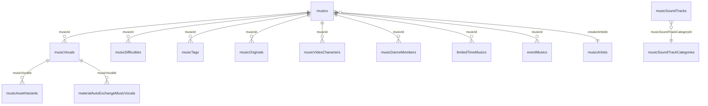

# sekai-master-db-diff-main 音乐相关字段汇总

> [!NOTE]
> 本文档从 `sekai-master-db-diff-main` 文件夹中提取了所有与音乐相关的 JSON 文件及其字段结构。
> 共计 **18 个文件**，以下按功能分组整理。

---

## 1. musics.json — 音乐基本信息（主表）

| 字段名 | 类型 | 说明 |
|--------|------|------|
| `id` | int | 音乐唯一ID |
| `seq` | int | 排序序号 |
| `releaseConditionId` | int | 解锁条件ID，关联 [releaseConditions.json](file:///c:/Users/10693/Desktop/%E5%B9%B6%E9%9D%9E%E5%B7%A5%E4%BD%9C%E5%86%85%E5%AE%B9/Project%20Sekai%202DMV%20Database/sekai-master-db-diff-main/releaseConditions.json) |
| `categories` | string[] | MV类别，如 `"mv"`, `"mv_2d"`, `"image"`, `"original"` |
| `title` | string | 歌曲标题 |
| `pronunciation` | string | 标题的平假名读音 |
| `creatorArtistId` | int | 创作者/艺术家ID，关联 [musicArtists.json](file:///c:/Users/10693/Desktop/%E5%B9%B6%E9%9D%9E%E5%B7%A5%E4%BD%9C%E5%86%85%E5%AE%B9/Project%20Sekai%202DMV%20Database/sekai-master-db-diff-main/musicArtists.json) |
| `lyricist` | string | 作词者 |
| `composer` | string | 作曲者 |
| `arranger` | string | 编曲者（无则为 `"-"`） |
| `dancerCount` | int | MV舞者人数 |
| `selfDancerPosition` | int | 玩家角色在舞蹈队形中的位置 |
| `assetbundleName` | string | 封面图资源包名，如 `"jacket_s_001"` |
| `liveTalkBackgroundAssetbundleName` | string | Live Talk 背景资源包名 |
| `publishedAt` | long | 游戏内发布时间戳（毫秒） |
| `releasedAt` | long | 原曲发布时间戳（毫秒） |
| `liveStageId` | int | Live舞台ID |
| `fillerSec` | float | 填充/前奏秒数 |
| `isNewlyWrittenMusic` | bool | 是否为游戏原创书写下曲目 |
| `isFullLength` | bool | 是否为完整版 |

---

## 2. musicVocals.json — 音乐歌声版本

| 字段名 | 类型 | 说明 |
|--------|------|------|
| `id` | int | 歌声版本唯一ID |
| `musicId` | int | 关联的音乐ID → [musics.json](file:///c:/Users/10693/Desktop/%E5%B9%B6%E9%9D%9E%E5%B7%A5%E4%BD%9C%E5%86%85%E5%AE%B9/Project%20Sekai%202DMV%20Database/sekai-master-db-diff-main/musics.json) |
| `musicVocalType` | string | 歌声类型：`"original_song"`(原唱V家)、`"sekai"`(世界版本)、`"another_vocal"` 等 |
| `seq` | int | 在同一首歌中的排序 |
| `releaseConditionId` | int | 解锁条件ID |
| `caption` | string | 版本描述，如 `"バーチャル・シンガーver."`、`"セカイver."` |
| `characters` | object[] | 演唱角色列表（嵌套对象） |
| `characters[].id` | int | 角色-歌声关联记录ID |
| `characters[].musicId` | int | 关联音乐ID |
| `characters[].musicVocalId` | int | 关联歌声版本ID |
| `characters[].characterType` | string | 角色类型：`"game_character"` / `"outside_character"` |
| `characters[].characterId` | int | 角色ID |
| `characters[].seq` | int | 角色排序 |
| `assetbundleName` | string | 音频资源包名，如 `"0001_01"` |
| `archivePublishedAt` | long | 音乐归档发布时间戳（毫秒） |

---

## 3. musicDifficulties.json — 音乐难度信息

| 字段名 | 类型 | 说明 |
|--------|------|------|
| `id` | int | 难度记录唯一ID |
| `musicId` | int | 关联的音乐ID → [musics.json](file:///c:/Users/10693/Desktop/%E5%B9%B6%E9%9D%9E%E5%B7%A5%E4%BD%9C%E5%86%85%E5%AE%B9/Project%20Sekai%202DMV%20Database/sekai-master-db-diff-main/musics.json) |
| `musicDifficulty` | string | 难度等级：`"easy"` / `"normal"` / `"hard"` / `"expert"` / `"master"` / `"append"` |
| `playLevel` | int | 游玩等级（数字难度值） |
| `totalNoteCount` | int | 总音符数量 |

---

## 4. musicTags.json — 音乐标签

| 字段名 | 类型 | 说明 |
|--------|------|------|
| `id` | int | 标签记录唯一ID |
| `musicId` | int | 关联的音乐ID → [musics.json](file:///c:/Users/10693/Desktop/%E5%B9%B6%E9%9D%9E%E5%B7%A5%E4%BD%9C%E5%86%85%E5%AE%B9/Project%20Sekai%202DMV%20Database/sekai-master-db-diff-main/musics.json) |
| `musicTag` | string | 标签名：`"all"` / `"vocaloid"` / `"light_music_club"`(Leo/need) / `"idol"`(MORE MORE JUMP!) / `"street"`(Vivid BAD SQUAD) / `"theme_park"`(Wonderlands×Showtime) / `"school_refusal"`(25時、ナイトコードで。) / `"other"` |
| `seq` | int | 标签排序 |

---

## 5. musicArtists.json — 音乐创作者/艺术家

| 字段名 | 类型 | 说明 |
|--------|------|------|
| `id` | int | 艺术家唯一ID |
| `name` | string | 艺术家名称 |
| `pronunciation` | string | 名称的平假名读音 |

---

## 6. musicOriginals.json — 原曲视频链接

| 字段名 | 类型 | 说明 |
|--------|------|------|
| `id` | int | 记录唯一ID |
| `musicId` | int | 关联的音乐ID → [musics.json](file:///c:/Users/10693/Desktop/%E5%B9%B6%E9%9D%9E%E5%B7%A5%E4%BD%9C%E5%86%85%E5%AE%B9/Project%20Sekai%202DMV%20Database/sekai-master-db-diff-main/musics.json) |
| `videoLink` | string | 原曲视频链接（YouTube / Niconico） |

---

## 7. musicVideoCharacters.json — MV出演角色

| 字段名 | 类型 | 说明 |
|--------|------|------|
| `id` | int | 记录唯一ID |
| `musicId` | int | 关联的音乐ID → [musics.json](file:///c:/Users/10693/Desktop/%E5%B9%B6%E9%9D%9E%E5%B7%A5%E4%BD%9C%E5%86%85%E5%AE%B9/Project%20Sekai%202DMV%20Database/sekai-master-db-diff-main/musics.json) |
| `defaultMusicType` | string | 默认音乐类型：`"original_music"` / `"sekai"` |
| `gameCharacterUnitId` | int | 游戏角色Unit ID |
| `dancePriority` | int | 舞蹈优先级（站位排序） |
| `seq` | int | 排序序号 |

---

## 8. musicDanceMembers.json — MV舞蹈成员编成

| 字段名 | 类型 | 说明 |
|--------|------|------|
| `id` | int | 记录唯一ID |
| `musicId` | int | 关联的音乐ID → [musics.json](file:///c:/Users/10693/Desktop/%E5%B9%B6%E9%9D%9E%E5%B7%A5%E4%BD%9C%E5%86%85%E5%AE%B9/Project%20Sekai%202DMV%20Database/sekai-master-db-diff-main/musics.json) |
| `defaultMusicType` | string | 默认音乐类型：`"original_music"` / `"sekai"` |
| `characterId1` ~ `characterId5` | int | 舞蹈位置1~5的角色ID（可选，最多5人） |
| `unit1` ~ `unit5` | string | 对应角色所属组合：`"piapro"` / `"light_sound"` / `"idol"` / `"street"` / `"theme_park"` / `"school_refusal"` |

---

## 9. musicAchievements.json — 音乐成就定义

| 字段名 | 类型 | 说明 |
|--------|------|------|
| `id` | int | 成就唯一ID |
| `musicAchievementType` | string | 成就类型：`"score_rank"` / `"combo"` |
| `musicAchievementTypeValue` | string | 成就值：评级如 `"RANK_C"` ~ `"RANK_S"`，combo比例如 `"0.25"` ~ `"1"` |
| `musicDifficultyType` | string | （可选）关联难度：`"easy"` ~ `"master"` / `"append"` |
| `resourceBoxId` | int | 奖励资源箱ID |

---

## 10. musicCollaborations.json — 音乐联动/合作

| 字段名 | 类型 | 说明 |
|--------|------|------|
| `id` | int | 联动唯一ID |
| `label` | string | 联动名称，如 `"ゲキ！チュウマイコラボ"`、`"東方Projectコラボ"` |

---

## 11. musicAssetVariants.json — 音乐资源变体

| 字段名 | 类型 | 说明 |
|--------|------|------|
| `id` | int | 变体记录唯一ID |
| `musicVocalId` | int | 关联歌声版本ID → [musicVocals.json](file:///c:/Users/10693/Desktop/%E5%B9%B6%E9%9D%9E%E5%B7%A5%E4%BD%9C%E5%86%85%E5%AE%B9/Project%20Sekai%202DMV%20Database/sekai-master-db-diff-main/musicVocals.json) |
| `seq` | int | 排序序号 |
| `musicAssetType` | string | 资源类型：`"jacket"`(封面) / `"mv"`(MV) |
| `assetbundleName` | string | 替代资源包名 |

---

## 12. musicSoundTracks.json — 游戏原声音轨

| 字段名 | 类型 | 说明 |
|--------|------|------|
| `id` | int | 音轨唯一ID |
| `seq` | int | 排序序号 |
| `title` | string | 音轨标题 |
| `pronunciation` | string | 标题的平假名读音 |
| `musicSoundTrackCategoryId` | int | 分类ID → [musicSoundTrackCategories.json](file:///c:/Users/10693/Desktop/%E5%B9%B6%E9%9D%9E%E5%B7%A5%E4%BD%9C%E5%86%85%E5%AE%B9/Project%20Sekai%202DMV%20Database/sekai-master-db-diff-main/musicSoundTrackCategories.json) |
| `assetbundleName` | string | 音频资源路径 |
| `assetbundleFileName` | string | 音频文件名 |

---

## 13. musicSoundTrackCategories.json — 原声音轨分类

| 字段名 | 类型 | 说明 |
|--------|------|------|
| `id` | int | 分类唯一ID |
| `name` | string | 分类名称：`"ユニット総合"` / `"バチャシン"` / `"レオニ"` / `"モモジャン"` / `"ビビバス"` / `"ワンダショ"` / `"ニーゴ"` / `"ゲーム内"` / `"マイセカイ"` / `"シナリオ"` / `"ライブ"` / `"バーチャルライブ"` / `"ガチャ"` / `"その他"` / `"コラボ"` |
| `assetbundleName` | string | 分类封面资源包名 |

---

## 14. musicNewlyWrittenInstrumentals.json — 新编纯音乐

> 当前为空数组 `[]`，暂无数据。

---

## 15. limitedTimeMusics.json — 限时音乐

| 字段名 | 类型 | 说明 |
|--------|------|------|
| `id` | int | 记录唯一ID |
| `musicId` | int | 关联的音乐ID → [musics.json](file:///c:/Users/10693/Desktop/%E5%B9%B6%E9%9D%9E%E5%B7%A5%E4%BD%9C%E5%86%85%E5%AE%B9/Project%20Sekai%202DMV%20Database/sekai-master-db-diff-main/musics.json) |
| `startAt` | long | 限时开始时间戳（毫秒） |
| `endAt` | long | 限时结束时间戳（毫秒） |

---

## 16. backgroundMusics.json — 背景音乐

| 字段名 | 类型 | 说明 |
|--------|------|------|
| `id` | int | 背景音乐唯一ID |
| `title` | string | 背景音乐标题（通常与歌曲名相同） |

---

## 17. eventMusics.json — 活动关联音乐

| 字段名 | 类型 | 说明 |
|--------|------|------|
| `eventId` | int | 活动ID → [events.json](file:///c:/Users/10693/Desktop/%E5%B9%B6%E9%9D%9E%E5%B7%A5%E4%BD%9C%E5%86%85%E5%AE%B9/Project%20Sekai%202DMV%20Database/sekai-master-db-diff-main/events.json) |
| `musicId` | int | 关联的音乐ID → [musics.json](file:///c:/Users/10693/Desktop/%E5%B9%B6%E9%9D%9E%E5%B7%A5%E4%BD%9C%E5%86%85%E5%AE%B9/Project%20Sekai%202DMV%20Database/sekai-master-db-diff-main/musics.json) |
| `seq` | int | 排序序号 |
| `releaseConditionId` | int | 解锁条件ID |

---

## 18. materialAutoExchangeMusicVocals.json — 素材自动兑换歌声版本

| 字段名 | 类型 | 说明 |
|--------|------|------|
| `id` | int | 记录唯一ID |
| `materialId` | int | 素材ID → [materials.json](file:///c:/Users/10693/Desktop/%E5%B9%B6%E9%9D%9E%E5%B7%A5%E4%BD%9C%E5%86%85%E5%AE%B9/Project%20Sekai%202DMV%20Database/sekai-master-db-diff-main/materials.json) |
| `musicVocalId` | int | 关联歌声版本ID → [musicVocals.json](file:///c:/Users/10693/Desktop/%E5%B9%B6%E9%9D%9E%E5%B7%A5%E4%BD%9C%E5%86%85%E5%AE%B9/Project%20Sekai%202DMV%20Database/sekai-master-db-diff-main/musicVocals.json) |
| `obtainAt` | long | 获得时间戳（毫秒） |

---

## 关系图

